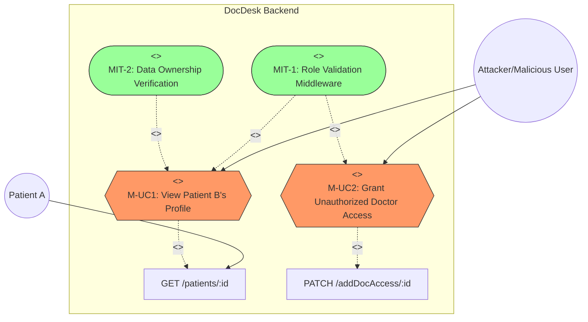

# DocDesk: Security Vulnerability Assessment & Mitigation Report
## Risk 2: Broken Access Control (Missing Role-Based Authorization)

**Member Name**: [User Name]
**Index Number**: [Index Number]
**Assignment**: IS4660 - Mini Project (Continuous Assessment)
**Task**: Risk 2 Identification, Analysis, and Mitigation

---

### 1. Introduction
Broken Access Control (BAC) occurs when an application does not properly enforce restrictions on what authenticated users are allowed to do. In the DocDesk platform, several API endpoints were found to be missing server-side role validation, allowing users to potentially access restricted data or perform unauthorized actions.

### 2. Risk Identification
A source code audit of the DocDesk backend revealed that while a `verifyRoles` middleware exists, it is inconsistently applied across critical routes in `Doctor.Routes.js` and `Patients.Routes.js`.

#### 2.1 Missing Role Enforcement on Sensitive Patient Data
In `Docdesk-backend/routes/Patients.Routes.js`, the endpoint to retrieve patient details lacks any role check beyond basic authentication.

**Vulnerable Code Snippet:**
```javascript
// Patients.Routes.js - Line 21
router.get("/:id", getPatient); // No verifyRoles middleware applied
```

**Technical Explanation:**
Any authenticated user (e.g., another patient) can guess a Patient ID and access their full medical profile. There is no check to ensure that the requester is either the patient themselves or an authorized doctor.

#### 2.2 Lack of Authorization for Modifying Access Permissions
Endpoints that modify who can access patient data were found unprotected.

**Vulnerable Code Snippet:**
```javascript
// Patients.Routes.js - Lines 30-33
router.patch("/addDocAccess/:id", addDocAccess);
router.patch("/removeDocAccess/:id", removeDocAccess);
```

**Technical Explanation:**
These endpoints allow adding or removing doctor access to a patient record. Without role enforcement, an attacker could manipulate these requests to grant themselves (or a malicious doctor) access to any patient's private history.

---

### 3. Impact Analysis
The impact of Broken Access Control is **High**:

1.  **Unauthorized Data Exposure**: Violation of patient privacy (HIPAA-like risks) by allowing unauthorized users to view sensitive medical history.
2.  **Privilege Escalation**: A standard user (Patient) could potentially perform actions intended for Doctors or Admins by hitting unprotected endpoints.
3.  **Data Integrity Loss**: Malicious actors could remove authorized doctors from a patient's access list, disrupting healthcare delivery.

---

### 4. Mitigation Strategies

#### 2.3 Exposed Admin Registration Endpoint [FIXED]
The portal authentication routes allowed anyone to register an administrative account without any prior authorization.

**Vulnerable Code Snippet:**
```javascript
// portalAuth.Routes.js - Line 11
router.post("/signup", adminSignUp); // No AuthMiddleware or verifyRoles
```

**Technical Explanation:**
By sending a POST request to `/api/portal/auth/signup`, an external attacker could create a DocDesk administrator account, granting them full control over doctors, patients, and system settings.

---

### 3. Impact Analysis
The impact of Broken Access Control is **Critical**:

1.  **System Takeover**: Unauthorized admin creation leads to complete compromise of the platform.
2.  **Unauthorized Data Exposure**: Violation of patient privacy (HIPAA-like risks) by allowing unauthorized users to view sensitive medical history.
3.  **Privilege Escalation**: Standard users could perform restricted actions by manipulating guessed IDs.

---

### 4. Mitigation Strategies

#### 4.1 Consistent Application of `verifyRoles` Middleware
Every endpoint has been updated to include a backend check to ensure the user's role is authorized for that specific action.

**Corrected Code Example (Portal Auth):**
```javascript
router.post("/signup", AuthMiddleware, verifyRoles("admin"), adminSignUp);
```

#### 4.2 Implementation of Data Ownership Checks (Object-Level Authorization)
For endpoints accessing specific IDs, the backend must verify that the authenticated user owns that record or has an explicit relationship to it. (To be further refined in controller logic).

---

### 5. Mis-Use Case Diagram (UML)


---
**Report Generated by Antigravity AI**
