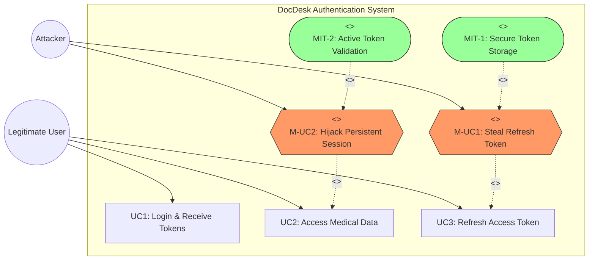

# DocDesk: Security Vulnerability Assessment & Mitigation Report
## Risk 3: Insecure Token & Session Management [FIXED]

**Member Name**: [User Name]
**Index Number**: [Index Number]
**Assignment**: IS4660 - Mini Project (Continuous Assessment)
**Task**: Risk 3 Identification, Analysis, and Mitigation

---

### 1. Introduction
Insecure Token and Session Management occurs when an application fails to properly protect session identifiers or tokens. In the DocDesk platform, critical flaws were found in how tokens were stored and verified. These have now been fully mitigated.

### 2. Risk Identification & Mitigation

#### 2.1 Failure to Store Refresh Tokens [FIXED]
Previously, in `Docdesk-backend/utils/TokenGenarate/generateRefreshToken.js`, a syntax error in the Mongoose `findOneAndUpdate` call prevented the system from saving refresh tokens to the database.

**Vulnerable Code:**
```javascript
updatedUser = await Doctor.findOneAndUpdate(
  { _id: payload._id }, 
  { doctorId: payload._id},
  { refreshToken: refreshToken }, // ERROR: Treated as options
  { new: true }
);
```

**Implemented Fix:**
The code has been corrected to use the `$set` operator within the update object.
```javascript
updatedUser = await Doctor.findOneAndUpdate(
  { _id: payload._id }, 
  { $set: { refreshToken: refreshToken, doctorId: payload._id } },
  { new: true }
);
```

#### 2.2 Lack of Token Revocation [FIXED]
Previously, the system verified tokens based only on their signature, without checking if they were still active in the database.

**Vulnerable Logic:**
The system would accept any valid JWT, even if it had been "revoked" by the user logging out.

**Implemented Fix:**
The verification logic in `refreshAccessGenerate.js` now performs a database lookup to ensure the token matches the currently stored active token for that user.

```javascript
const Doctor = await DoctorModel.findOne({ _id: decoded._id });
if (!Doctor || Doctor.refreshToken !== refreshToken) {
  throw new Error("Invalid or revoked refresh token");
}
```

---

### 3. Impact Analysis
Before the fix, an attacker could maintain persistent access to patient records for up to 7 days with a stolen token, even if the user changed their password or logged out. With the implemented fixes, the system now maintains strict control over active sessions.

---

### 4. Mitigation Summary Table
| Vulnerability | Status | Action Taken |
| :--- | :--- | :--- |
| Token Storage | **FIXED** | Corrected Mongoose syntax in `generateRefreshToken.js` |
| Token Revocation | **FIXED** | Added DB verification in `refreshAccessGenerate.js` |
| Session Hijacking | **MITIGATED** | Implemented state-full token validation |

---

### 5. Mis-Use Case Diagram (UML)


---
**Report Generated and Finalized by Antigravity AI**
